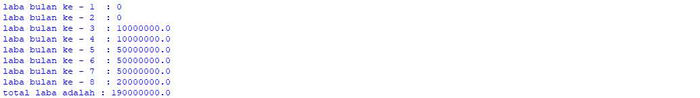

# PROSES / LANGKAH - LANGKAH PRAKTIKUM 4

# Lab 1
## Tugas 1

### - Buat program sederhana mencari bilangan terbesar dari dua buah variabel menggunakan if

- Pertama kita harus memasukan inputan  seperti gambar di bawah ini 

- Setelah itu kita enter,kemudian masukan if untuk menjalankan program yang sebelumnya lalu tambah kan a > b: 
Lalu lakukan perintah ("print bilangan terbesar = :")

- Selanjutnya tambah kan else untuk menambah kan aksi untuk menentukan mana yang lebih besar antara a dan b

- Masukan nilai yang di inginkan saya memasukan angka dan maka nilai terbesar nya adalah nah setelah di running inilah hasil nya

##  Tugas 2

### - Buat program mengurutkan data berdasarkan input sejumlah data dari tiga buah variabel dari data terkecil

- Kita mulai dengan memasukan inputan seperti di bawah ini

- Lalu tambah kan if dan yang lainya agar seperti gambar di bawah ini 

- Codingan yang saya buat 

- Kita mulai dengan if a < b dan if b > c lalu tambah kan else untuk penambah percabangan maka ini lah hasil pada saat di running

## Tugas 3

### -  mengurutkan angka 

- Kita mulai lagi dengan codingan seperti di bawah ini dengan for i range (0,10)

- Masukan for i range 0,10 supaya mendapat kan angka 1 sampai 10 lalu gabungkan i + j kemudin print untuk menghasilkan kan running gambar di bawah ini

## tugas 4

### - Untuk mencari nilai n dan data 

- Kita mulai dengan codingan seperti gambar di bawah ini 

- Setelah itu kita running maka akan ada perintah untuk memasukan nilai N maka saya isi dengan angka 5 dan hasil nya adalah seperti gambar di bawah ini

# lab 2
## Tugas praktikum 2

### - Mencari bilangan terbesar

- Buat program sederhana dengan input tiga buah bilangan,dari ketiga bilangan tersebut menggunakan if

- Setelah melakukan perintah di atas masukan lah bilangan dari yang terbesar hingga terkecil maka akan ada hasil yang terbesar yang mana

# flowchart lab 2 

- Kita akan mencari nilai terbesar dari ketiga variabel tersebut Menentukan 3 varibel Eskpresikan dengan memasukan inputan Lalu kita akan melihat perbedaan bilangan terbesar antara ketiga nilai variabel Ekspresikan dengan membuat satu statemenet di variabel 

# lab 3
## latihan 1 

- pertama kita akan deklarasi dan juga beri inputan ke variabel menggunakan variabel lalu import random dengan memberi nilai secara acak  memberi batasan dengan variabel baru jumlah nya adalah 5 membuat kondisi dengan menggunakan if ekspresikan hasil yang kita buat

# flowchart latihan 1

## Latihan 2

- Pertama tama masukn max = 0

- Fungsi nya adalah untuk mengetahui nilai terbesar nya yang mana lalu enter kemudian tambahkan perintah while true  : setelah itu enter pastikan spasi dua kali x int (input("masukan bilangan :")) lalu if max <x: 
Kemudian pastikan sejajar dengan x masukan perintah max = x kemudian enter masukan perintah if x == 0: kemudian berikan spasi agar tidak sama dengan if masukan break untuk menghentikan adanya perulangan  

 

- Memasukan nilai terbesar atau jumlah 

# Flowchart latihan 2 

## pemrograman 1

# latihan 3

### - Jumlah total laba dari bulan 1 sampai 8

- Masukan nilai a = 100000000 kemudian masukan perintah for x in range ( 1,9) supaya ada 9 buah bulan pertama dan kedua laba hasil nya 0% bulan kedua ketiga hasil nya 1% bulan keempat sampai ketujuh naik sebelum nya 4% menjadi 5% bulan kedelapan 3% menurun 

- Maka hasil nya akan keluar seperti gambar runnning di bawah ini dari data bulan 1 sampai dengan bulan ke 8 beserta hasil nya 

# Flowchart latihan 3

