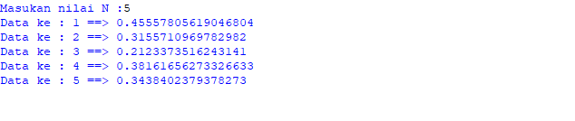

# PROSES / LANGKAH - LANGKAH PRAKTIKUM 4

## Latihan 1

### - Mencari bilangan terbesar dari dua buah variabel

Pertama kita harus memasukan inputan  seperti gambar di bawah ini 

Setelah itu kita enter,kemudian masukan if untuk menjalankan program yang sebelumnya lalu tambah kan a > b: 
Lalu lakukan perintah ("print bilangan terbesar = :")

Selanjutnya tambah kan else untuk menambah kan aksi untuk menentukan mana yang lebih besar antara a dan b

Masukan nilai yang di inginkan saya memasukan angka dan maka nilai terbesar nya adalah nah setelah di running inilah hasil nya

##  Latihan 2

### - mencari nilai terbesar dari tiga buah variabel

Kita mulai dengan memasukan inputan seperti di bawah ini

Lalu tambah kan if dan yang lainya agar seperti gambar di bawah ini 

Codingan yang saya buat 

Kita mulai dengan if a < b dan if b > c lalu tambah kan else untuk penambah percabangan maka ini lah hasil pada saat di running

## Latihan 3

### -  mengurutkan angka 

Kita mulai lagi dengan codingan seperti di bawah ini dengan for i range (1,10)

Lakukan perintah ("ini di luar pernyataan if")

Masukan for i range 1,10 supaya mendapat kan angka 1 sampai 10 lalu gabungkan i + j kemudin print untuk menghasilkan kan running gambar di bawah ini

## Latihan 4

### - Untuk mencari nilai n dan data 

Kita mulai dengan codingan seperti gambar di bawah ini 

Setelah itu kita running maka akan ada perintah untuk memasukan nilai N maka saya isi dengan angka 5 dan hasil nya adalah seperti gambar di bawah ini

## latihan 5

### - Mencari bilangan terbesar

Mulai dengan masukan x,y,z sebagai perintah inputan memasukan bilangan kemudian tambahkan if sebagai menandakan x lebih besar dari z lalu titik dua maka akan seperti ini  if x > z : lakukan juga hal yng sama pada y dan z masukan bilangan terbesar lalu tambah kan elif dan else sebagai penambah aksi sebagai penentu x lebih besar dari z dan y lebih besar dari z maka hasil codingan setelah di running nya seperti ini 

Setelah melakukan perintah di atas masukan lah bilangan dari yang terbesar hingga terkecil maka akan ada hasil yang terbesar yang mana

## Latihan 6

### - Mencari nilai n yang terbesar jumlah nya

Pertama tama masukn max = 0

Fungsi nya adalah untuk mengetahui nilai terbesar nya yang mana lalu enter kemudian tambahkan perintah while true  : setelah itu enter pastikan spasi dua kali x int (input("masukan bilangan :")) lalu if max <x: 
Kemudian pastikan sejajar dengan x masukan perintah max = x kemudian enter masukan perintah if x == 0: kemudian berikan spasi agar tidak sama dengan if masukan break 

 

Memasukan nilai terbesar atau jumlah 

## Latihan 7 

### - Jumlah total laba dari bulan 1 sampai 8

Masukan nilai a = 800000000 kemudian masukan perintah for x in range ( 1,9) supaya ada 9 buah masukan if seperti di gambar di bawah ini kemudian print total laba 

Maka hasil nya akan keluar seperti gambar runnning di bawah ini dari data bulan 1 sampai dengan bulan ke 8 beserta hasil nya 

